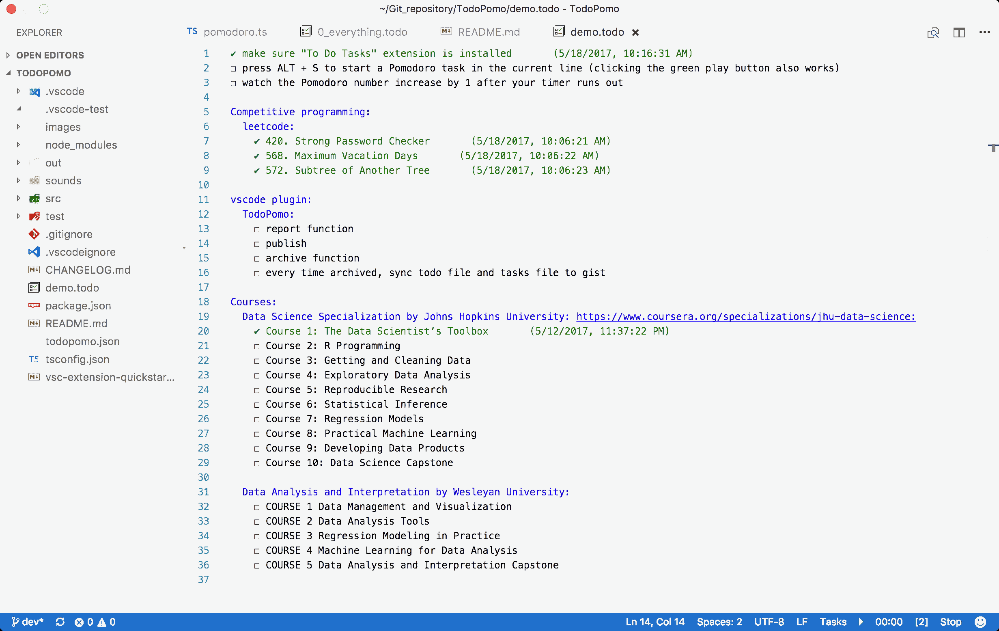

# TodoPomo README

TodoPomo is a Visual Studio Code extension that combines To Do Task and Pomodoro. It helps you focus on 25-mins work period and track your everyday achievements.

When editting "To Do Tasks" file, you can start a Pomodoro with a task name by placing cursor in the task line and pressing ALT + S shortcut or clicking the green play button at the bottom right corner.

TodoPomo provides you background white noise when working, you can change it or disable it.

Todopomo allows you to specify the task file where you organize and store your plans, the default task file location is "~/.everything.todo". You finished tasks are stored in the "~/.todopomo.json".

The number on the right hand of the counting down clock indicates how many Pomodoro you have finished today, helps track your daily work load.

## Requirements

You must install extension "To Do Tasks".

## Extension Settings

This extension contributes the following settings:

* `todopomo.task_duarion`: the duration of a TodoPomo Task in minutes, the default is 25
* `todopomo.break_duarion`: the duration of a Break in minutes, the default is 5
* `todopomo.long_break_duarion`: the duration of a long Break in minutes, the default is 15
* `todopomo.counter_to_long_break`: number of regular breaks before a long break, the default is 3
* `todopomo.todo_file`: full path to the todo task file, when left blank, the default setting ~/.everything.todo is picked.
* `todopomo.tasks_file`: full path to the tasks.json file, when left blank, the default setting ~/.todopomo.json is picked
* `todopomo.sound_file`: relative path to the background white noise file, set black to cancel sound, the default is "sounds/rain_with_thunder.wav"

## Credits

Credit for vscode-pomodoro code goes to [Ygilany](https://github.com/Ygilany/vscode-pomodoro)

Credit for "To Do Tasks" extension goes to [Sandeep Somavarapu](https://github.com/sandy081/vscode-todotasks)

<!--
## Features

Describe specific features of your extension including screenshots of your extension in action. Image paths are relative to this README file.

For example if there is an image subfolder under your extension project workspace:

\!\[feature X\]\(images/feature-x.png\)

> Tip: Many popular extensions utilize animations. This is an excellent way to show off your extension! We recommend short, focused animations that are easy to follow.

## Extension Settings

Include if your extension adds any VS Code settings through the `contributes.configuration` extension point.

For example:

This extension contributes the following settings:

* `myExtension.enable`: enable/disable this extension
* `myExtension.thing`: set to `blah` to do something

## Known Issues

Calling out known issues can help limit users opening duplicate issues against your extension.

## Release Notes

Users appreciate release notes as you update your extension.

### 1.0.0

Initial release of ...

### 1.0.1

Fixed issue #.

### 1.1.0

Added features X, Y, and Z.
-->